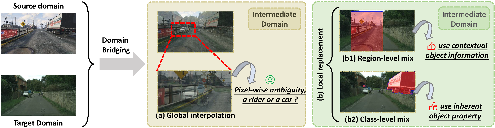
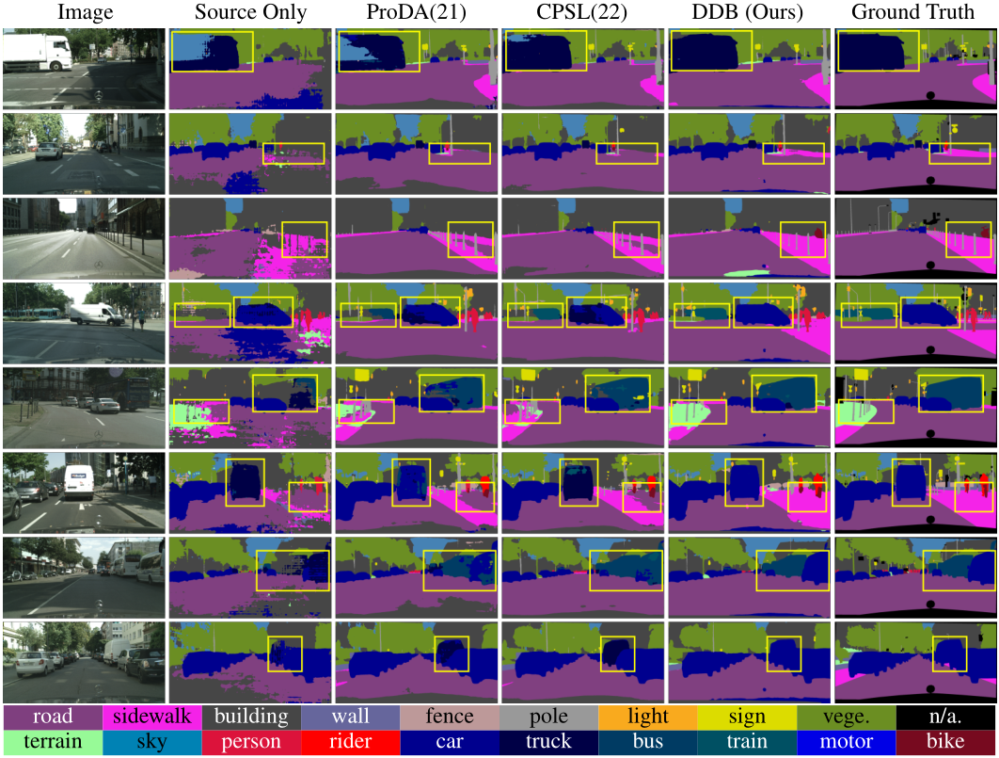

## Deliberated Domain Bridging for Domain Adaptive Semantic Segmentation
[](https://paperswithcode.com/sota/domain-adaptation-on-gtav-synscapes-to?p=deliberated-domain-bridging-for-domain)

[](https://paperswithcode.com/sota/domain-adaptation-on-gtav-to-cityscapes-1?p=deliberated-domain-bridging-for-domain)

[](https://paperswithcode.com/sota/domain-adaptation-on-gta5-to-cityscapes?p=deliberated-domain-bridging-for-domain)

This repo is the official PyTorch implementation of Deliberated Domain Bridging for Domain Adaptive
Semantic Segmentation (DDB).


### [[ArXiv]](https://arxiv.org/abs/2209.07695)
By [Lin Chen](https://scholar.google.com/citations?user=-t92FH8AAAAJ&hl=zh-CN&oi=sra), [Zhixiang Wei](), 
[Xin Jin](https://scholar.google.com/citations?hl=en&user=byaSC-kAAAAJ), 
[Huaian Chen](https://scholar.google.com/citations?user=D6ol9XkAAAAJ&hl=en&oi=sra), 
[Yi Jin](https://scholar.google.com/citations?hl=en&user=mAJ1dCYAAAAJ), 
[Miao Zheng](https://github.com/MeowZheng), 
[Kai Chen](https://scholar.google.com/citations?hl=en&user=eGD0b7IAAAAJ). 



## Citation
If you find our work useful and use the code or models for your research, please cite our work as follows:
```none
@article{chen2022deliberated,
  title={Deliberated Domain Bridging for Domain Adaptive Semantic Segmentation},
  author={Chen, Lin and Wei, Zhixiang and Jin, Xin and Chen, Huaian and Zheng, Miao and Chen, Kai and Jin, Yi},
  journal={arXiv preprint arXiv:2209.07695},
  year={2022}
}
```
## News
### 2022.11.14 We are happy to announce that DDB obtained the spotlight award at NeurIPS2022✨ 
### 2022.09.15 We are happy to announce that DDB was accepted at NeurIPS2022✨ 
### 2022.09.15 Release the core code of our CVPR2022 paper [DALN](https://github.com/xiaoachen98/DALN)
### 2022.07.02 Release code on github.

## Abstract
>In unsupervised domain adaptation (UDA), directly adapting from the source to the target domain usually suffers significant discrepancies and leads to insufficient alignment. 
Thus, many UDA works attempt to  vanish the domain gap gradually and softly via various intermediate spaces, dubbed domain bridging (DB). 
However, for dense prediction tasks such as domain adaptive semantic segmentation (DASS), existing solutions have mostly relied on rough style transfer and how to elegantly bridge domains is still under-explored. 
In this work, we resort to data mixing to establish a *deliberated domain bridging (DDB)* for DASS, through which the joint distributions of source and target domains are aligned and interacted with each in the intermediate space. 
At the heart of DDB lies a *dual-path domain bridging* step for generating two intermediate domains using the coarse-wise and the fine-wise data mixing techniques, 
alongside a *cross-path knowledge distillation* step for taking two complementary models trained on generated intermediate samples 
as ‘teachers’ to develop a superior ‘student’ in a multi-teacher distillation manner. 
These two optimization steps work in an alternating way and reinforce each other to give rise to DDB with strong adaptation power. 
Extensive experiments on adaptive segmentation tasks with different settings demonstrate that our DDB significantly outperforms state-of-the-art methods.

## Results
 We conduct experiments on the single-source, multi-source, and multi-target domain settings, separately. 
 Under the same architecture (ResNet101 + DeepLabV2), DDB can achieve the best results in all three domain settings. 
 Especially in the **multi-source and multi-target domain settings**, DDB significantly improves the state-of-the-art performance by **10.0 and 11.1 mIoU** separately.

 | Checkpoints                                    | Source          | Target                 | mIoU         |
 |-----------------|------------------------|--------------|--------|
 | weights/gta+syn2cs/r2-ckd-pro-bs1x4/weight.pth | gta             | cityscape              | 62.7         |
 | weights/gta+syn2cs/r2-ckd-pro-bs1x4/weight.pth | gta<br>synscapes | cityscape              | 69.0         |
 | weights/gta2cs+map/r2-ckd-pro-bs1x4/weight.pth | gta             | cityscape<br>mapillary | 60.4<br>56.9 |

The above checkpoints can be obtained through
[GoogleDrive](https://drive.google.com/drive/folders/1ypTyXVcxdEA-yeUCedwMtyWukFSC92mg?usp=share_link). 
After downloading, please put them under the project folder.

## Environment
In this project, we use python 3.8.13 and pytorch==1.8.1, torchvision==0.9.1, mmcv-full==1.4.7, mmseg==0.22.1. 

The environment can be quickly set up as follows:

```shell
cd DDB
conda create -n ddb python=3.8
conda activate ddb
make install
```

## Setup Datasets

**Cityscapes:** Please, download leftImg8bit_trainvaltest.zip and
gt_trainvaltest.zip from [here](https://www.cityscapes-dataset.com/downloads/)
and extract them to `data/cityscapes`.

**Mapillary** Please, download MAPILLARY v1.2 from [here](https://research.mapillary.com/) 
and extract them to `data/mapillary`.

**GTA:** Please, download all image and label packages from
[here](https://download.visinf.tu-darmstadt.de/data/from_games/) and extract them to 'data/gta'

**Synscapes:** Please, download Synscapes from
[here](https://synscapes.on.liu.se/download.html) and extract it to `data/synscapes`.

Then, you should prepare datasets as follows:
```shell
cd DDB
mkdir data
# If you prepare the data at the first time, you should convert the data for validation
python tools/convert_datasets/gta.py data/gta # Source domain
python tools/convert_datasets/synscapes.py data/synscapes # Source domain
python tools/convert_datasets/cityscapes.py data/cityscapes
# convert mapillary to cityscape format and resize it for efficient validation
python tools/convert_datasets/mapillary2cityscape.py data/mapillary \
data/mapillary/cityscapes_trainIdLabel --train_id # convert the format
python tools/convert_datasets/mapillary_resize.py data/mapillary/validation/images \
data/mapillary/cityscapes_trainIdLabel/val/label data/mapillary/half/val_img \
data/mapillary/half/val_label # resize the validation data
```

The final folder structure should look like this:

```none
DDB
├── ...
├── weights
├── data
│   ├── cityscapes
│   │   ├── leftImg8bit
│   │   │   ├── train
│   │   │   ├── val
│   │   ├── gtFine
│   │   │   ├── train
│   │   │   ├── val
│   ├── mapillary
│   │   ├── training
│   │   ├── cityscapes_trainIdLabel
│   │   ├── half
│   │   │   ├── val_img
│   │   │   ├── val_label
│   ├── gta
│   │   ├── images
│   │   ├── labels
│   ├── synscapes
│   │   ├── img
│   │   │   ├── rgb
│   │   │   ├── class
├── ...
```

## Evaluation
Download the folder  [weights](https://drive.google.com/drive/folders/1mdIcSrOPTgzbB8zSFtoM2pzWlB0S3mpA?usp=sharing) and place it in the project directory.

Then you can verify the results by selecting different config files in `configs/tests` and running following command.
```shell
python tools/test.py {config} {weight} --eval mIoU
```

## Training

### Step 1 on Round 1

Using following commands, you will receive two complementary teacher models (`cu_model` and `ca_model`)
```shell
# Train on the coarse region-path (using cross-domain cut-mix for domain bridging)
python tools/train.py configs/gta2city/r1_st_cu_dlv2_r101v1c_1x4_512x512_40k_gta2city.py
# Train on the fine class-path (using cross-domain class-mix for domain bridging)
python tools/train.py configs/gta2city/r1_st_ca_dlv2_r101v1c_1x4_512x512_40k_gta2city.py
# Train on the coarse region-path (using cross-domain cut-mix for domain bridging) (Train with multiple GPUs)
bash tools/dist_train.sh configs/gta2city/r1_st_cu_dlv2_r101v1c_2x2_512x512_40k_gta2city.py 2 # GPU_NUM=2
# Train on the fine class-path (using cross-domain class-mix for domain bridging) (Train with multiple GPUs)
bash tools/dist_train.sh configs/gta2city/r1_st_ca_dlv2_r101v1c_2x2_512x512_40k_gta2city.py 2 # GPU_NUM=2
```

### Step 2 on Round 1

After step 1, you should rename the checkpoints and put them in the checkpoints' folder manually. Such as:

```none
DDB
├── ...
├── checkpoints
│   ├── gta2city_round1
│   │   ├── gta2city_st-cu_dlv2.pth
│   │   ├── gta2city_st-ca_dlv2.pth
├── ...
```
If you want to use adaptive ensemble technique for cross-path knowledge distillation (CKD). You should run:
```shell
# Generating prototypes for the coarse region-path teacher on target domain
python tools/cal_prototypes/cal_prototype.py {CU_MODEL_CONFIG_DIR} --checkpoint={CU_MODEL_CHECKPOINT_DIR}
# Generating prototypes for the fine class-path teacher on target domain
python tools/cal_prototypes/cal_prototype.py {CA_MODEL_CONFIG_DIR} --checkpoint={CA_MODEL_CHECKPOINT_DIR}
```
Then, you can run the following command for CKD:
```shell
# Distillate the knowledge from two teacher models to a student model
python tools/train.py configs/gta2city/r1_ckd_dlv2_r101v1c_1x4_512x512_40k_gta2city.py
# Train with multiple GPUs
bash tools/dist_train.sh configs/gta2city/r1_ckd_dlv2_r101v1c_2x2_512x512_40k_gta2city.py 2 # GUP_NUM=2
```

After step 2, you should rename the checkpoints and put it in the checkpoints' folder manually. Such as:

```none
DDB
├── ...
├── checkpoints
│   ├── gta2city_round1
│   │   ├── gta2city_st-cu_dlv2.pth
│   │   ├── gta2city_st-ca_dlv2.pth
│   │   ├── gta2city_ckd-pro_dlv2.pth
├── ...
```

### Step 1 on Round 2

```shell
# Self-training again with weights initialized by step2 on stage 1
python tools/train.py configs/uda/st/gta2cs_st-cu-r2_dlv2red-adapter_r101v1c_poly10warm_s0.py
# Self-training again with weights initialized by step2 on stage 1
python tools/train.py configs/uda/st/gta2cs_st-ca-r2_dlv2red-adapter_r101v1c_poly10warm_s0.py
```
### Step 2 on Round 2

After step 1 on round 2, you should rename the checkpoints and put them in the checkpoints' folder manually. Such as:

```none
DDB
├── ...
├── checkpoints
│   ├── gta2cs_round2
│   │   ├── gta2cs_st-cu_dlv2.pth
│   │   ├── gta2cs_st-ca_dlv2.pth
├── ...
```
If you want to use adaptive ensemble technique for cross-path knowledge distillation (CKD). You should run:
```shell
# Generating prototypes for the coarse region-path teacher on target domain
python tools/cal_prototypes/cal_prototype.py {CU_MODEL_CONFIG_DIR} --checkpoint={CU_MODEL_CHECKPOINT_DIR}
# Generating prototypes for the fine class-path teacher on target domain
python tools/cal_prototypes/cal_prototype.py {CA_MODEL_CONFIG_DIR} --checkpoint={CA_MODEL_CHECKPOINT_DIR}
```
Then, you can run the following command for CKD:
```shell
# Distillate the knowledge from two teacher models to a student model
python tools/train.py configs/gta2city/r2_ckd_dlv2_r101v1c_1x4_512x512_40k_gtav2cityscapes.py
# Train with multiple GPUs
bash tools/dist_train.sh configs/gta2city/r2_ckd_dlv2_r101v1c_2x2_512x512_40k_gtav2cityscapes.py 2 # GUP_NUM=2
```

## Acknowledgment
Our implementation is mainly based on following repositories. Thanks for their authors.
* [MMSegmentation](https://github.com/open-mmlab/mmsegmentation)
* [DAFormer](https://github.com/lhoyer/DAFormer)
* [DACS](https://github.com/vikolss/DACS)
* [ProDA](https://github.com/microsoft/ProDA)
* [SoftTeacher](https://github.com/microsoft/SoftTeacher)
